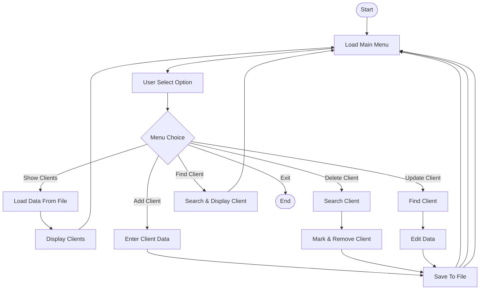

```mermaid
flowchart TD

A([Start]) --> B[Load Main Menu]
B --> C[User Select Option]

C --> D{Menu Choice}

D -->|Show Clients| E[Load Data From File]
E --> F[Display Clients]
F --> B

D -->|Add Client| G[Enter Client Data]
G --> H[Save To File]
H --> B

D -->|Delete Client| I[Search Client]
I --> J[Mark & Remove Client]
J --> H
H --> B

D -->|Update Client| K[Find Client]
K --> L[Edit Data]
L --> H
H --> B

D -->|Find Client| M[Search & Display Client]
M --> B

D -->|Exit| N([End])
```
