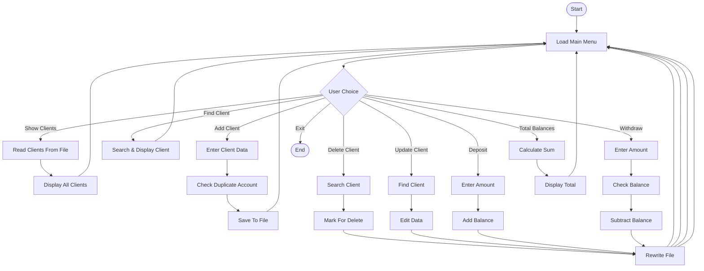

```mermaid
flowchart TD

A([Start]) --> B[Load Main Menu]
B --> C{User Choice}

C -->|Show Clients| D[Read Clients From File]
D --> E[Display All Clients]
E --> B

C -->|Add Client| F[Enter Client Data]
F --> G[Check Duplicate Account]
G --> H[Save To File]
H --> B

C -->|Delete Client| I[Search Client]
I --> J[Mark For Delete]
J --> K[Rewrite File]
K --> B

C -->|Update Client| L[Find Client]
L --> M[Edit Data]
M --> K
K --> B

C -->|Find Client| N[Search & Display Client]
N --> B

C -->|Deposit| O[Enter Amount]
O --> P[Add Balance]
P --> K
K --> B

C -->|Withdraw| Q[Enter Amount]
Q --> R[Check Balance]
R --> S[Subtract Balance]
S --> K
K --> B

C -->|Total Balances| T[Calculate Sum]
T --> U[Display Total]
U --> B

C -->|Exit| V([End])
```
